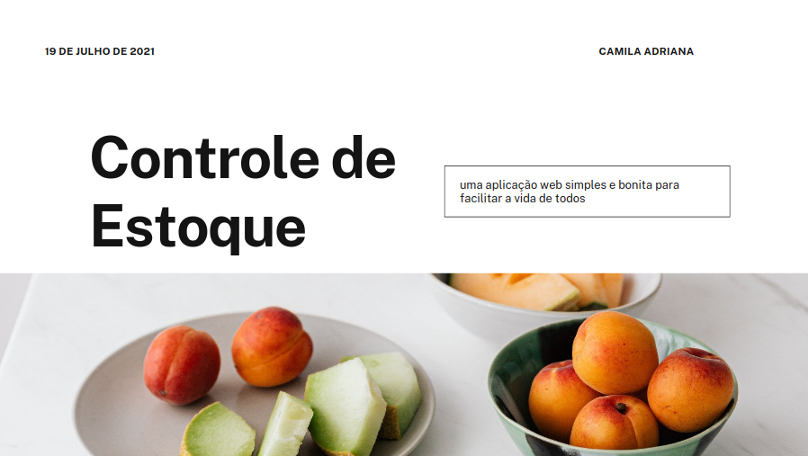

<h1 align="center">Controle de Estoque</h1>
<p>Criar uma aplicação de Controle de Estoque onde a mesma tenha um design simples e belo, com intuito de promover o aprendizado utilizando o framework Django</p>
<h4 align="center"> 
	🚧  Status 🚀 Refatorando o código  🚧
</h4>

<h1 align="center">
  
</h1>
<p text-align="justify">Este repositório tem foco, na criação de uma aplicação de Controle de Estoque de um estabelecimento, interligado a um banco de dados provido pelo próprio Framework Django facilitando dessa forma a manipulação de seus dados.</p>
<p text-align="justify">Este projeto faz parte do meu portfólio pessoal, então, ficarei feliz caso você forneça algum feedback, código, estrutura, funcionalidade ou qualquer melhoria que você possa relatar para melhora-lo.Você pode usar este projeto como quiser, seja para estudar, fazer melhorias, você quem manda!.</p>

<blockquote>
Este é um projeto totalmente grátis!
</blockquote>

### 🏁 Features

- [x] Cadastro de Usuário
- [x] Cadastro de Produto
- [x] Cadastro de Empresa
- [x] Cadastro de Vendedor
- [x] Listagem de Produtos
- [x] Listagem de Empresa
- [x] Listagem de Gerentes
- [ ] Deletar Produto
- [X] Desativar Empresa
- [ ] Deletar Vendedor
- [x] Login
- [x] Reset de senha
- [ ] PDF com as informações das movimentações do mês
- [ ] Acessando Informações Filtradas


### 🛠 Tecnologias
<p>As seguintes ferramentas foram usadas na construção do projeto:</p>

- [Django](https://www.djangoproject.com/start/)
- [Bootstrap](https://getbootstrap.com/)


### ⚠️ Warning
<p>Esse código é uma refatoração do meu antigo projeto que esta disponivel aqui no meu GitHub. Ele possui mais funcionalidades e identação de código</p>

- [Controle-de-estoque](https://github.com/GomesMilla/Controle-de-estoque)

<h1>Rodando o projeto</h1>
<h4>Clonando o projeto</h4>
<p>Dentro da pasta onde o projeto ficará armazenado, abra o terminal.</p>

<h5>Clonando via HTTPS:</h5>


```
git init
https://github.com/GomesMilla/ControleDeEstoque.git
cd ControleDeEstoque

```


<h4>Linux</h4>
<blockquote>
  Observação: Foi utilizado a distro Linux Mint(versão 20.1), caso ocorra algum problema na instalação, pesquise por conta própria a resolução do mesmo!
</blockquote>
<h4>Linux</h4>

``` 
sudo apt-get install python3-venv
```

<h4>Preparando o Projeto</h4>

```
python3 -m venv env
source env/bin/activate
python -m pip install --upgrade pip
pip install -r requirements.txt
python manage.py makemigrations Usuarios
python manage.py makemigrations Estoque
python manage.py makemigrations Transacao
python manage.py migrate
python manage.py createsuperuser
python manage.py runserver

```

### Autor
---


 
 <sub><b>Camila Adriana</b></sub></a> <a href="www.linkedin.com/in/camila-adriana-gomes-de-jesus-04767b1ba" title="Foto de perfil"></a><br>
Feito com ❤️ por Camila Adriana 👋🏽 Entre em contato!

[](https://twitter.com/CamilaA58109563?s=09) [](https://www.linkedin.com/in/camila-adriana-gomes-de-jesus-04767b1ba/) 
